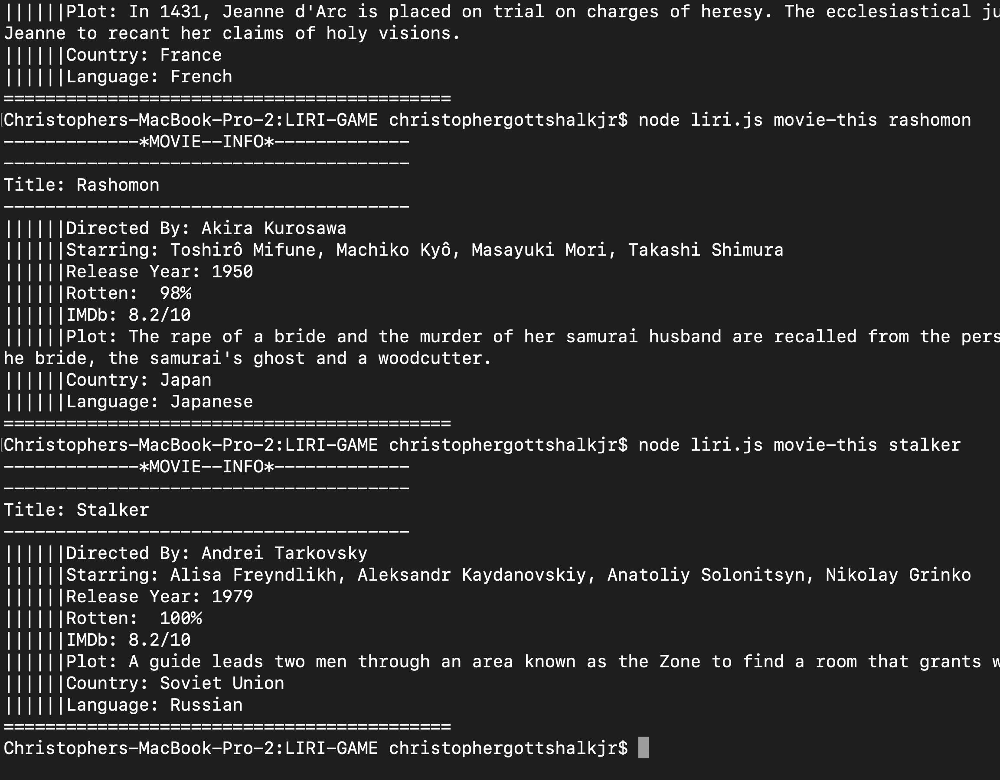
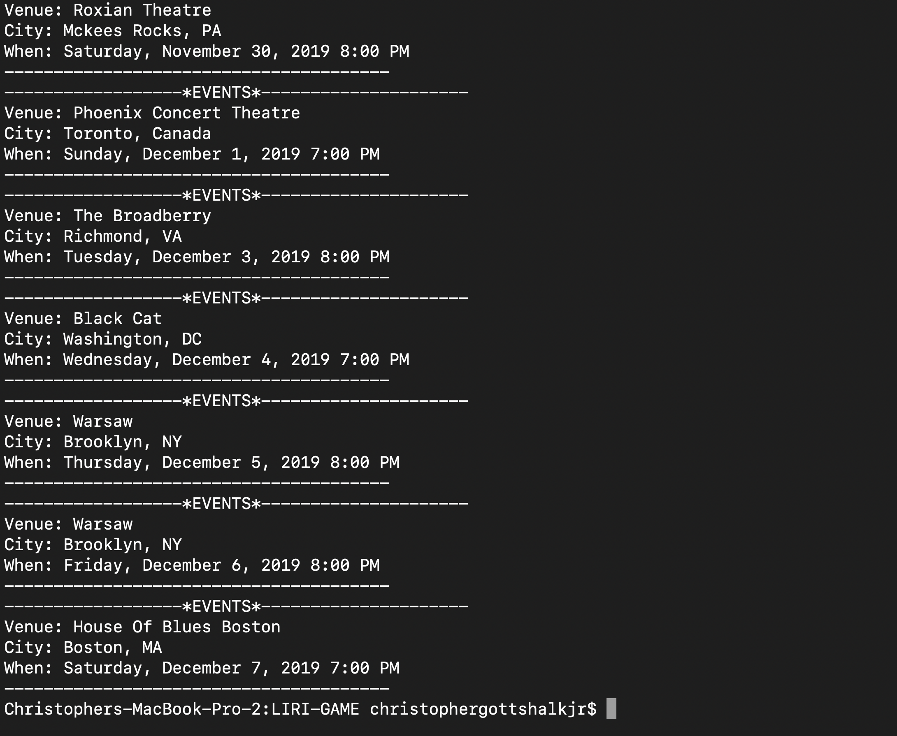
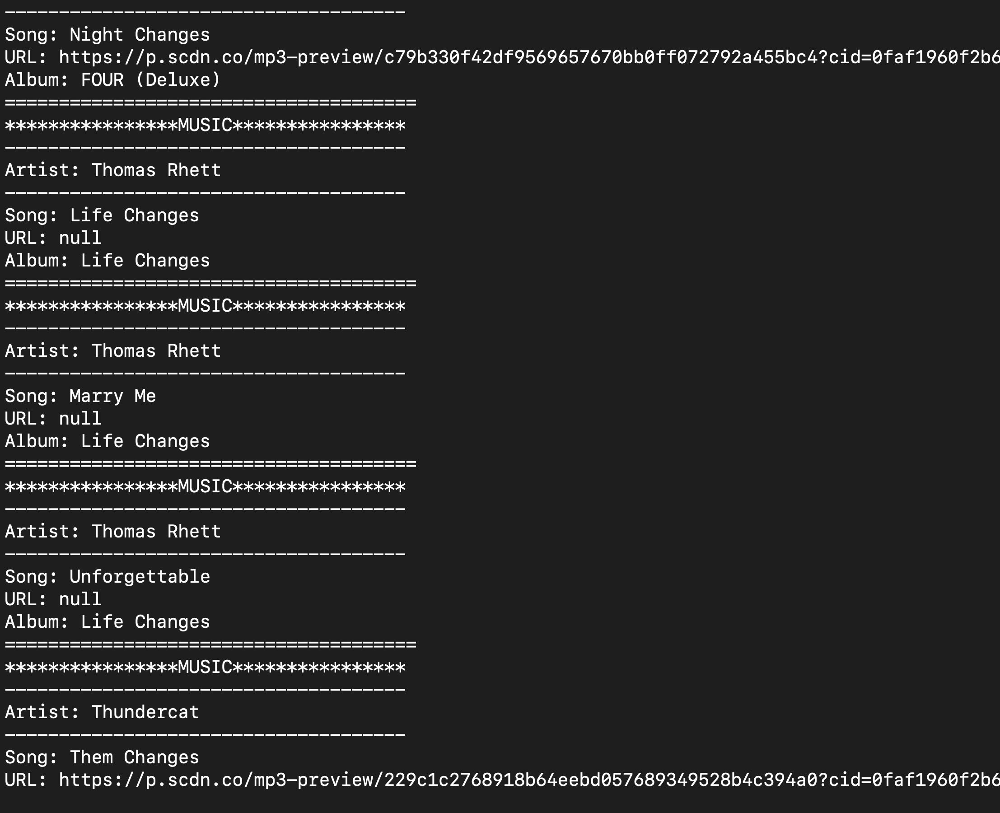
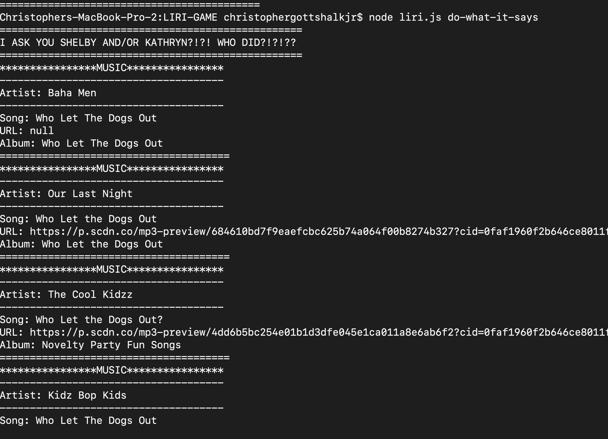

# LIRI-GAME
---
>Created by **Christopher Gottshalk**
---
**LIRI-GAME** is an node based app where everything happens on the command line in terminal. There are multiples node packages being installed in this app. AXIOS, SPOTIFY, MOMENT. 
 LIRI is like iPhone's SIRI. However, while SIRI is a Speech Interpretation and Recognition Interface, LIRI is a _Language_ Interpretation and Recognition Interface. LIRI will be a command line node app that takes in parameters and gives you back data.

### INSTRUCTIONS 
---
1. Open the app in your terminal. 
2. Make sure to type **node** followed by **liri.js** as your command line arguments.
3. Next type one of these four commands...
    * **movie-this** (followed by a movie you want information about)
    * **concert-this** (followed by a band you would like to see in concert)
    * **spotify-this-song** (followed by a song you would like to hear a preview of)
    * **do-what-it-says** (you will type this by itself)
4. If you don't follow the commands an auto selection will be provided

---

### Pictures of Game in Action!
---

---
---

---
---

---
---

---
---
### TECHNOLOGIES USED
---
* Javascript
* Nodejs
* Node packages:
* Node-Spotify-API
* Axios
* Moment
 
* Bands in Town
* OMDB
* Git
* GitHub